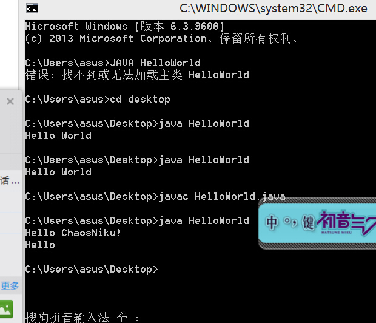

#task0000
##任务目的
* 带领大家熟悉github study flow
* 练习git命令

##start
编写Demo.java文件，输出Hello World
push 到自己的仓库


##The Result
* author by ZPX<br>
This is the image followed<br>
###截图
<br>
###My code
` ``java
public class HelloWorld{
```
public static void main(String args[]){
```
```
System.out.println("Hello Chaos!");
```
System.out.printf("Hello \t\n");
}
}