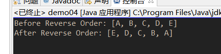

#task0002
##任务目的
* 掌握java中的Array

##基础练习
* [数组练习](http://www.tutorialspoint.com/javaexamples/java_arrays.htm)
* 5.22之前提交pr

##完成情况
###截图
*每张图为一个demo的截图
*demo1 
 
*demo2 
 
*demo3 
 
*demo4 
 
*demo5 
 
*demo6 
 
>*一开始并不清楚max的用法，查看了api
 
>*demo7 
 
>**addAll方法继承自collection接口
 
>*剩余截图请看img文件夹
>##总结
>本次的task使我重新了解了关于array的一些方法，并通过查阅api弄清了他们的用法